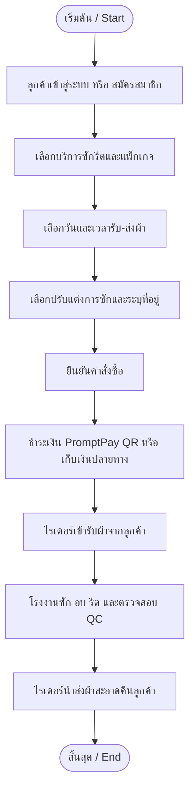
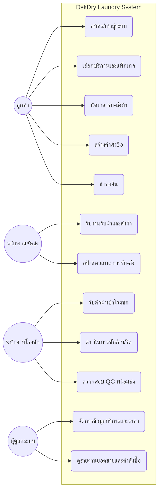
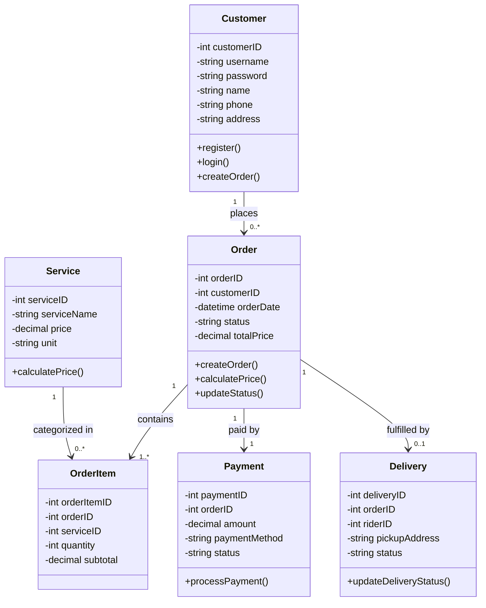

# Software Requirements Specification (SRS) & System Design
**วิชา:** COMP252 วิศวกรรมซอฟต์แวร์ (Software Engineering)  
**โปรเจกต์:** DekDry Laundry Delivery System @ PSRU (ระบบบริการซักอบรีดออนไลน์)

---

## 1. ผังการทำงานของระบบ (Process Flowchart)

---

## 2. Use Case Diagram

---

## 3. Class Diagram & Data Architecture

